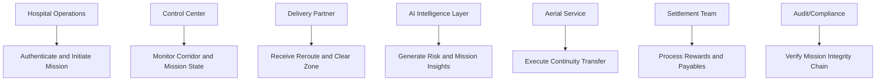

# SIPRA Project Brief (PPT-Ready)

## 1) Project in One Line
SIPRA is an AI-orchestrated emergency **organ-transport command platform** for Green Corridor and golden-hour transplant logistics, combining hospital authentication, live corridor intelligence, Gemma-powered analytics, blockchain-style trust verification, and an autonomous **drone continuity service** for critical handoff missions.

## 2) Core Problem We Solve
Emergency medical transport often breaks due to fragmented coordination across hospitals, road traffic, partners, and response systems. SIPRA addresses this by delivering:
- Real-time corridor intelligence around active medical transit
- Instant reroute signaling for surrounding traffic participants
- Predictive risk detection for deadline breach
- Autonomous continuity action through aerial transfer logic
- Post-mission trust, audit, and settlement transparency

## 3) Real Production Architecture (Main Backend)
Core architecture is implemented through Go services and supporting infrastructure.

### Architecture snapshot
- **Core API**: Go + Fiber (`services/core-go/cmd/server/main.go`)
- **Hot ingest layer**: Redis buffering (`internal/store/redis/ping_cache.go`)
- **Durable system of record**: Postgres + PostGIS (`internal/store/postgres`, `migrations/001_init.sql`)
- **Geospatial engine**: rolling corridor generation with `ST_MakeLine` + `ST_Buffer`
- **Realtime events**: WebSocket hub for mission updates
- **Partner distribution**: HMAC-signed webhook worker pipeline with retries
- **Risk orchestration**: AI polling + automated handoff-state transition
- **Aerial continuity integration**: drone dispatch client

## 4) End-to-End Runtime Flow
### A) Operational mission flow
1. Mission trip is created.
2. Ambulance telemetry pings are ingested with immediate acknowledgment.
3. Pings are buffered in Redis, then flushed to Postgres.
4. PostGIS recomputes the active exclusion corridor.
5. Corridor updates are broadcast to mission clients.
6. Partner systems receive signed reroute updates.

### B) Golden-hour continuity flow
1. Risk monitor evaluates in-transit mission state.
2. AI risk service predicts breach probability.
3. On threshold breach, mission transitions to handoff mode.
4. Aerial continuity dispatch is triggered.
5. Handoff event is emitted across realtime channels.

## 5) Data and State Design
### Storage model
- **Redis**: low-latency ingest and active trip indexing
- **Postgres**: mission truth for trips, pings, corridors, partner outcomes
- **PostGIS**: geospatial computation and verification

### Corridor versioning model
- Corridor history is append-versioned, not overwritten.
- Previous versions are closed with validity windows.
- Full geospatial timeline remains auditable.

### Trip lifecycle
`Created -> InTransit -> DroneHandoff -> Delivered`

## 6) API Surface (Presentation Highlights)
### Core mission APIs
- `POST /api/v1/trips`
- `GET /api/v1/trips/:id`
- `POST /api/v1/trips/:id/start`
- `POST /api/v1/trips/:id/pings`

### Bounty and checkpoint APIs
- `POST /api/v1/trips/:id/bounties`
- `POST /api/v1/bounties/:id/claim`
- `POST /api/v1/bounties/:id/verify`

### Realtime channel
- `GET /ws/dashboard`
- Event types: `GPS_UPDATE`, `CORRIDOR_UPDATE`, `HANDOFF_INITIATED`, `FLEET_SPAWN`, `REROUTE_STATUS`

### Controlled chaos APIs
- `POST /api/v1/chaos/flood-bridge`
- `POST /api/v1/chaos/spawn-fleet`
- `POST /api/v1/chaos/force-handoff`
- `POST /api/v1/chaos/reset`

## 7) AI Intelligence Layer
- Risk predictor service over FastAPI for breach classification
- Generative intelligence integration through Gemma (`gemma-3-27b-it`) for mission narratives and stakeholder insights
- Structured outputs include:
  mission summary, risk status, driver intelligence, what-if analysis, and continuity rationale

## 8) Platform Module Inventory (What We Built)
### Verification and Access Module
- Institutional onboarding form
- Email OTP issuance and verification
- License document upload workflow
- AI-assisted verification summary
- Verification-state access gating for mission operations

### Mission Control Module
- Four-surface command layout
- Rolling corridor visualization and exclusion boundaries
- Driver state intelligence around zone compliance
- Emergency transfer and aerial continuity phases
- Operator controls for speed, state, and mission flow
- Partner-routing interoperability for high-density fleet ecosystems

### Driver Response Module
- Driver-facing reroute response experience
- High-priority corridor evacuation alerts
- Route-state transition from normal to emergency behavior

### Dispatch Intelligence Module
- Live geolocation intake
- Hospital discovery via Places API
- Road route intelligence via Directions API
- On-route hospital filtering and ETA-based routing choices

### Trust Ledger Module
- Hash-linked mission event blocks
- Integrity states: `Pending`, `Verifying`, `Verified`, `Failed`
- Full-chain verification action
- Tamper-detection visibility

### Rewards and Settlement Module
- Deterministic partner reward computation
- Billing transparency (distance fee, platform charge, compliance fee)
- Settlement intelligence narratives through Gemma

## 9) System Differentiation and USP
### How this differs from existing approaches
- Extends beyond tracking to full orchestration across access, routing, response, continuity, and settlement.
- Combines geospatial control, predictive intelligence, and trust/audit transparency in one platform.
- Integrates road and aerial continuity in a single operational command model.

### USP
- **Closed-loop medical logistics intelligence**: `Authenticate -> Orchestrate -> Predict -> Continuity -> Verify -> Settle`
- **Trust-native operations** with hash-chained mission records
- **Google-native intelligence stack** aligned with Maps, Places, Directions, and Gemma capabilities

## 10) Reliability and Integrity Highlights
- Prometheus metrics exposure via `/metrics`
- Health diagnostics via `/healthz`
- Backpressure-aware webhook worker queue
- Timeout and retry safeguards on external service calls
- Geospatial verification controls through PostGIS proximity checks
- Integration and unit coverage on critical backend paths

## 11) Security and Governance Notes
- Signed partner payload delivery (HMAC)
- Access-gated operational modules
- Mission event traceability through chain-style ledger records
- Controlled operational endpoints for scenario injection

## 12) Suggested Slide Sequence
1. Problem and urgency in golden-hour logistics
2. SIPRA solution narrative
3. Core architecture and data flow
4. Access verification and mission initiation
5. Corridor control and partner response
6. AI risk intelligence and aerial continuity
7. Trust ledger and settlement transparency
8. Technology stack and implementation economics
9. Roadmap and scale strategy

## 13) Direct Answers for PPT (Requested 1-10)
### 1. Brief About the Solution
SIPRA is an end-to-end **organ-donation and transplant logistics command system** built for Green Corridor operations under strict golden-hour timelines. It authenticates hospitals, establishes a live **Golden Corridor**, and coordinates partner-fleet rerouting in real time to protect critical ambulance movement. When road risk crosses threshold, SIPRA activates a dedicated **drone continuity service** for autonomous handoff and rapid final-mile delivery. Its Gemma analytics layer and blockchain-style trust ledger provide decision intelligence and tamper-evident accountability across the full mission lifecycle.
 
### 2a. How It Is Different From Existing Ideas
- Moves from passive tracking to active orchestration.
- Unifies geospatial routing, AI risk logic, trust-chain audit, and rewards in one platform.
- Connects operational response and financial closure in the same mission lifecycle.

### 2b. How It Solves the Problem
- Reduces transit delay using continuous telemetry and corridor updates.
- Reduces response latency by instantly signaling reroute states.
- Preserves viability windows through predictive continuity activation.
- Increases accountability using verifiable mission records and clear settlement logic.

### 2c. USP of the Proposed Solution
- **Autonomous continuity loop** for golden-hour preservation
- **Trust-led mission auditability** with hash-linked records
- **Hybrid road-aerial orchestration** under one command architecture

### 3. List of Features Offered by the Solution
- Hospital OTP authentication and access control
- Document upload and AI-assisted verification analysis
- Real-time **Golden Corridor** operations and driver-zone intelligence
- Emergency transfer and aerial continuity orchestration
- Mission analytics via **Gemma-powered** reporting
- Driver response intelligence and reroute signaling
- **Blockchain-style trust ledger** with integrity verification
- Partner rewards and payable settlement intelligence
- Live hospital routing intelligence with Google APIs
- Delivery-partner coordination pipeline for large-scale fleet ecosystems

### 4. Process Flow Diagram or Use-Case Diagram
#### Process Flow


#### Use-Case View


### 5. Wireframes/Mock Diagrams of the Proposed Solution (Optional)
```text
[Verification and Access]
+---------------------------+----------------------------------------+
| Step rail + status card   | Registration + OTP + document flow     |
| Trust badge               | AI verification summary + proceed CTA  |
+---------------------------+----------------------------------------+

[Mission Command]
+--------------------+--------------------------+----------------+------------------+
| Ops + AI Controls  | Corridor and route view  | Driver view    | Trust ledger     |
| Analytics actions  | Zone and continuity view | Alert state    | Chain timeline   |
+--------------------+--------------------------+----------------+------------------+

[Settlement and Insights]
+------------------------------+-----------------------------------------+
| Mission financial summary    | Partner rewards + AI insight panels     |
| Compliance and payable view  | What-if and debrief intelligence        |
+------------------------------+-----------------------------------------+
```

### 6. Architecture Diagram of the Proposed Solution
```mermaid
flowchart TB
    subgraph UX[Next.js Platform Surfaces]
      VFY[Verification Access]
      OPS[Mission Command]
      DRV[Driver Response]
      DSP[Dispatch Intelligence]
      STL[Settlement Intelligence]
    end

    subgraph WEBAPI[Next.js API Layer]
      OTP[/api/send-otp + /api/verify-otp]
      GEM[/api/gemma]
      MAP[/api/places/* + /api/route/directions]
    end

    subgraph CORE[Go Core Backend]
      API[REST + WS Hub]
      RISK[Risk Monitor]
      WH[Webhook Dispatcher]
      CE[Corridor Engine]
    end

    subgraph DATA[Data Plane]
      REDIS[(Redis)]
      PG[(Postgres + PostGIS)]
    end

    subgraph EXT[External Integrations]
      GEMMA[Gemma API]
      GMAPS[Maps JavaScript API]
      GPLACES[Places API]
      GDIR[Directions API]
      AIB[Risk AI Service]
      FLEET[Partner Fleet Endpoint]
      DRONE[Drone Dispatch Endpoint]
    end

    VFY --> OTP
    OPS --> GEM
    DRV --> OPS
    DSP --> MAP
    STL --> GEM

    GEM --> GEMMA
    MAP --> GPLACES
    MAP --> GDIR
    OPS --> GMAPS
    DSP --> GMAPS

    API --> REDIS
    REDIS --> PG
    PG --> CE
    CE --> API
    CE --> WH
    WH --> FLEET
    RISK --> AIB
    RISK --> DRONE
```

### 7. Technologies to Be Used in the Solution
- **Backend**: Go, Fiber, pgx, Redis client, Zerolog
- **Data and geo**: PostgreSQL 16, PostGIS 3.4, Redis 7
- **AI services**: FastAPI risk service, Gemma integration via Generative Language API
- **Frontend**: Next.js 14, TypeScript, deck.gl, `@vis.gl/react-google-maps`
- **Google stack**: Maps JavaScript API, Places API, Directions API, Gemma model APIs
- **Service integration**: Node/Express partner and aerial endpoints
- **Infra**: Docker Compose, health and metrics observability

### 8. Estimated Implementation Cost (Optional)
Assumption: 12-week MVP, India-based implementation.
- Team: Backend (1), Frontend (1), Full-stack/AI (1), QA/DevOps support (shared)
- Engineering: **INR 18L - 32L**
- Infra, maps, API, tooling: **INR 1.5L - 4L**
- Estimated total: **INR 19.5L - 36L**

### 9. Snapshots of the MVP
- **Snapshot 1**: Verification and access workflow
- **Snapshot 2**: Mission command and corridor control
- **Snapshot 3**: Integrity ledger timeline and verification
- **Snapshot 4**: Driver response and alert transition
- **Snapshot 5**: Hospital dispatch intelligence and route selection
- **Snapshot 6**: Rewards settlement and AI debriefing

### 10. Additional Details / Future Development
- Introduce full OCR + compliance model pipeline for document verification.
- Expand mission identity and policy management with enterprise-grade access controls.
- Add external notarization options for integrity-chain proofs.
- Integrate live partner acknowledgements and SLA dashboards.
- Add production payout rails and reconciliation automation.

## 14) Q&A Log (Keep Appending Here)
Use this section for each new PPT question.

### Q: What is the deep architecture and feature analysis of this project?
A: SIPRA is architected as an event-driven medical logistics system where Go services manage ingestion, geospatial corridor computation, realtime propagation, predictive risk transition, and continuity orchestration, while the application layer provides access control, operational intelligence, trust visibility, and settlement transparency.
Notes: Emphasize orchestration depth, not isolated features.

### Q: Provide concise answers for points 1-10 with diagrams.
A: Completed in Section 13 with structured, presentation-ready responses and Mermaid diagrams for process, use-case, and architecture views.
Notes: Content is slide-compatible with minimal editing.

### Q: Re-evaluate feature coverage with stronger emphasis on AI, ledger integrity, OTP flow, partner rewards, and Google stack usage.
A: Completed by expanding module-level coverage across verification, mission control, dispatch, integrity chain, and settlement intelligence, while explicitly reflecting AI and Google integration depth.
Notes: This version is optimized for executive and jury-facing narration.

### Q: Strengthen the brief with explicit Golden Corridor, Gemma analytics, blockchain verification, and partner-fleet linkage.
A: Updated both the platform one-liner and the formal brief section to explicitly include Golden Corridor operations, Gemma AI analytics, blockchain-style trust verification, and delivery-partner ecosystem integration.
Notes: The core summary now reads as a complete systems narrative instead of a short functional statement.

### Q: Make the briefing explain what the system is (not only what it does), with clear organ-donation Green Corridor context.
A: Updated the one-line definition and the full brief to explicitly position SIPRA as an organ-transport command platform for Green Corridor and golden-hour transplant logistics, then layered the functional capabilities after that core identity.
Notes: The revised wording now reads as category + purpose + capability, which is stronger for judges and PPT audiences.

### Q: Make the briefing shorter, more refined, and explicitly mention drone service.
A: Updated both the top-line definition and the formal brief to explicitly present the drone service as an autonomous continuity layer that activates during high-risk transit and executes critical handoff/final-mile delivery.
Notes: The new wording is tighter, clearer, and better suited for high-impact presentation delivery.

---
Generated on: 2026-04-28
