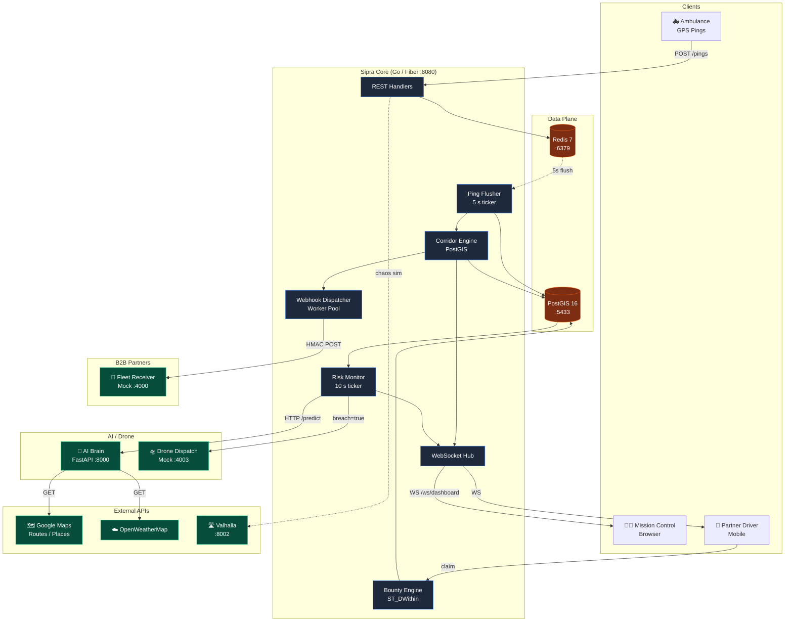
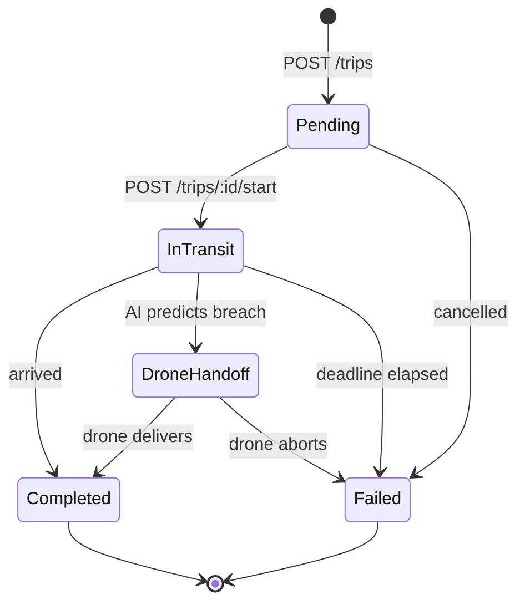
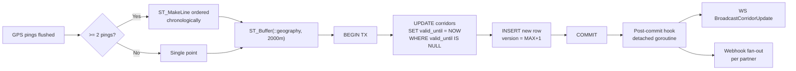
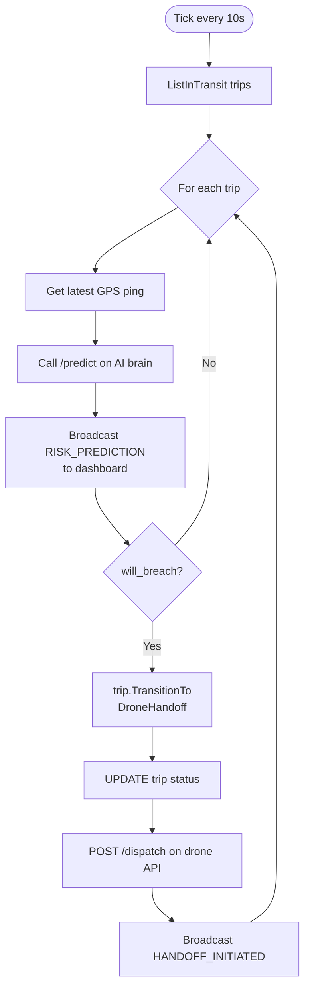
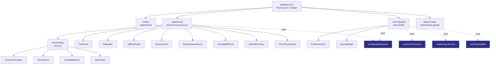

<div align="center">

# 🚑 Sipra
### Autonomous AI Orchestrator for Bio-Logistics

*Built for **Google Solutions Challenge 2026.***

> Coordinating emergency medical transport — organs, vaccines, blood —
> with **zero human dispatcher in the loop**.

[](https://go.dev)
[](https://nextjs.org)
[](https://www.python.org)
[](https://postgis.net)
[](https://redis.io)
[](https://docs.docker.com/compose/)

</div>

---

## 📖 Table of Contents

1. [The Problem](#-the-problem)
2. [The Solution](#-the-solution)
3. [Key Features](#-key-features)
4. [Tech Stack](#%EF%B8%8F-tech-stack)
5. [System Architecture](#%EF%B8%8F-system-architecture)
6. [Data Flow Diagrams](#-data-flow-diagrams)
7. [Folder Structure](#-folder-structure)
8. [Installation & Setup](#-installation--setup)
9. [Usage Guide](#-usage-guide)
10. [API Reference](#-api-reference)
11. [WebSocket Contract](#-websocket-contract)
12. [Screenshots](#-screenshots)
13. [Core Logic & Algorithms](#-core-logic--algorithms)
14. [Edge Cases](#-edge-cases-handled--missing)
15. [Future Improvements](#%EF%B8%8F-future-improvements)
16. [Contribution Guidelines](#-contribution-guidelines)
17. [License](#-license)

---

## 🩺 The Problem

Emergency medical cargo lives or dies inside a **golden-hour deadline** — the narrow window during which an organ remains transplantable, a vaccine remains potent, or a blood unit remains usable.

Today's logistics stack fails this window in three places:

| Pain Point | Today's Reality | Cost |
|---|---|---|
| **Dispatch** | Manual phone-tree between hospital, ambulance, partner fleets | 3 – 8 minutes lost per incident |
| **Corridor visibility** | Partner fleets (Uber, Swiggy, food delivery) have **zero awareness** of the ambulance's path | Every red light shared with civilian traffic |
| **Failsafe** | If the route slips past breach, the only fallback is "call a helicopter" | Often impossible inside city limits |

Sipra fixes that loop in software.

---

## 💡 The Solution

Sipra is an **event-driven orchestrator** that does three things continuously and autonomously:

1. **Broadcasts a rolling 2 km exclusion corridor** around the live ambulance position over webhooks, so partner fleets reroute *before* they intersect.
2. **Predicts golden-hour breach** every 10 seconds via a deterministic risk model fed by real Google Routes traffic + weather.
3. **Auto-dispatches a drone** the moment the breach probability crosses threshold — no human in the path.

The whole thing runs on a polyglot, three-layer async pipeline that keeps the ambulance ingest hot path under 5 ms even during a chaos surge.

---

## ✨ Key Features

- 🟢 **Sub-5 ms ingest hot path** — `POST /pings` returns `202` immediately; Redis is the buffer, Postgres flushes every 5 s.
- 🟢 **Versioned PostGIS corridors** — `ST_Buffer(ST_MakeLine(...))` recomputed per flush; old rows stamped `valid_until` (history-preserving, never `UPDATE`).
- 🟢 **Real-time WebSocket fan-out** — 7 envelope types broadcast over `/ws/dashboard` with non-blocking per-client buffers.
- 🟢 **B2B webhook dispatcher** — bounded worker pool, HMAC-signed payloads, mock partner verifies signatures end-to-end.
- 🟢 **Deterministic AI brain** — Python FastAPI: Google Routes + OpenWeatherMap → logistic-sigmoid breach probability.
- 🟢 **Drone failsafe** — Risk Monitor transitions `InTransit → DroneHandoff`, calls drone dispatch, broadcasts to dashboard.
- 🟢 **Surge-pricing bounty engine** — PostGIS `ST_DWithin` checkpoint verification + multiplier; partner drivers earn points.
- 🟢 **God-mode demo simulator** — 20 fleet vehicles on real Bangalore roads, ambulance on a Google-Directions polyline.
- 🟢 **Chaos panel** — flood a bridge, spawn fleets, force a handoff, all from `/admin/chaos`.
- 🟢 **Prometheus metrics** at `/metrics` — corridor compute duration, WS clients, handoffs triggered.

---

## 🛠️ Tech Stack

<table>
<tr><th>Layer</th><th>Technology</th></tr>
<tr><td><b>Core API</b></td><td>Go 1.26 · Fiber v2 · pgx/v5 · redis/v9 · zerolog · prometheus/client_golang</td></tr>
<tr><td><b>Database</b></td><td>PostgreSQL 16 + PostGIS 3.4 + uuid-ossp</td></tr>
<tr><td><b>Cache / Streams</b></td><td>Redis 7 (<code>allkeys-lru</code>, 256 MB cap)</td></tr>
<tr><td><b>AI Brain</b></td><td>Python 3.11 · FastAPI · Pydantic v2 · httpx · uvicorn</td></tr>
<tr><td><b>Routing engine</b></td><td>Valhalla (self-hosted, India southern-zone tiles)</td></tr>
<tr><td><b>Frontend</b></td><td>Next.js 14 (App Router) · React 18 · TypeScript strict · Deck.gl 9 · <code>@vis.gl/react-google-maps</code> · Tailwind v3 · shadcn/ui · Turf.js</td></tr>
<tr><td><b>Mocks</b></td><td>Node 18 · Express (fleet-receiver, drone-dispatch)</td></tr>
<tr><td><b>Infra</b></td><td>Docker Compose · Prometheus · GitHub-flavored CI-ready layout</td></tr>
</table>

---

## 🏗️ System Architecture

### High-Level View



### The Three Async Boundaries

Sipra's core design choice: **three independent tickers that never block each other.**

```mermaid
sequenceDiagram
    autonumber
    participant Amb as 🚑 Ambulance
    participant API as Go API
    participant R as Redis
    participant F as Flusher (5s)
    participant PG as Postgres
    participant CE as Corridor Engine
    participant WS as WS Hub
    participant W as Webhooks
    participant RM as Risk Monitor (10s)
    participant AI as AI Brain
    participant DR as Drone

    Note over Amb,API: ① INGEST (sub-5 ms)
    Amb->>API: POST /trips/:id/pings
    API->>R: HSET buffer
    API-->>Amb: 202 Accepted

    Note over R,W: ② FLUSH (every 5 s)
    F->>R: drain buffer
    F->>PG: pgx.Batch INSERT
    F->>CE: CalculateRollingCorridor(tripID)
    CE->>PG: tx { close current; insert v#43;1 }
    CE->>WS: BroadcastCorridorUpdate
    CE->>W: BroadcastCorridor (worker pool)

    Note over RM,DR: ③ RISK (every 10 s)
    RM->>PG: ListInTransit
    RM->>AI: POST /predict
    AI-->>RM: {will_breach, eta, ...}
    RM->>WS: BroadcastRiskPrediction
    alt will_breach == true
        RM->>PG: UPDATE status = DroneHandoff
        RM->>DR: POST /dispatch
        DR-->>RM: {drone_id, eta_seconds}
        RM->>WS: BroadcastHandoffInitiated
    end
```

**Why three boundaries?**

A single synchronous pipeline (ingest → corridor → broadcast → predict) would couple ambulance latency to the slowest downstream consumer. Sipra isolates each stage with a buffer:

- **Ingest** writes to Redis and returns `202` — bounded by Redis RTT (sub-ms).
- **Flush** is a 5 s ticker that batches into Postgres — bounded by `pgx.Batch`.
- **Risk** is a 10 s ticker that calls the AI brain — bounded by the brain's 5 s SLA.

A stalled Postgres or a slow brain therefore *cannot* delay the next ping write.

---

## 📊 Data Flow Diagrams

### Trip State Machine



The state machine lives in [`services/core-go/internal/domain/trip.go`](services/core-go/internal/domain/trip.go). All transitions go through `Trip.TransitionTo(next, now)`; illegal transitions return `ErrInvalidTransition` and never touch the database.

### Corridor Lifecycle



Corridors are **versioned and history-preserving** — old rows are stamped with `valid_until = NOW()` rather than overwritten. This means the bounty engine can replay any historical corridor for verification.

### Risk Evaluation Flow



### Frontend Component Hierarchy



---

## 📁 Folder Structure

```
sipra/
├── README.md
├── TESTING-GUIDE.md
├── Makefile
├── docker-compose.yml                # postgres + redis + ai-brain + mocks + valhalla
├── .env.example
├── .gitignore
├── .editorconfig
│
├── infra/
│   └── docker/postgres/
│       ├── init.sql                  # PostGIS + uuid-ossp + schema
│       └── seed.sql                  # webhook_partners seed
│
├── services/
│   ├── core-go/                      # 🟦 Go 1.26 / Fiber backbone
│   │   ├── cmd/server/main.go        # composition root
│   │   ├── go.mod / go.sum
│   │   └── internal/
│   │       ├── api/
│   │       │   ├── rest/             # trips · pings · bounty · chaos · sim handlers
│   │       │   └── ws/live.go        # WS hub + 7 envelope types
│   │       ├── bounty/               # surge-pricing engine + repo
│   │       ├── config/               # caarlos0/env loader + .env discovery
│   │       ├── corridor/bbox.go      # PostGIS ST_Buffer rolling envelope
│   │       ├── domain/               # pure DDD (trip, bounty)
│   │       ├── metrics/              # Prometheus collectors
│   │       ├── risk/                 # AI brain client + drone client + monitor
│   │       ├── sim/valhalla_client.go
│   │       ├── store/
│   │       │   ├── postgres/         # pgx repos + migrations/001_init.sql
│   │       │   └── redis/            # ping cache + fleet tick stream
│   │       ├── webhooks/             # B2B dispatcher worker pool
│   │       └── test/integration/     # E2E pipeline test
│   │
│   ├── ai-brain/                     # 🟨 Python 3.11 / FastAPI
│   │   ├── Dockerfile
│   │   ├── pyproject.toml
│   │   ├── app/main.py               # /predict (haversine + weather + sigmoid)
│   │   └── tests/test_predict.py
│   │
│   ├── web/                          # 🟩 Next.js 14 / Deck.gl dashboard
│   │   ├── app/
│   │   │   ├── layout.tsx
│   │   │   ├── page.tsx              # → redirects to /intake
│   │   │   ├── intake/page.tsx       # IntakePortal
│   │   │   ├── dashboard/page.tsx    # MissionControlLayout
│   │   │   ├── driver/[tripId]/page.tsx
│   │   │   ├── admin/chaos/page.tsx
│   │   │   └── api/                  # Server-side proxies for Google APIs
│   │   │       ├── route/directions/
│   │   │       └── places/{hospitals,nearby,search}/
│   │   ├── components/
│   │   │   ├── intake/               # IntakePortal + hospitals.ts
│   │   │   ├── mission-control/      # 9 panels (Layout, Trip, Status, Handoff, …)
│   │   │   ├── driver/               # DriverShell, ExitRouteCard, BountyModal
│   │   │   ├── chaos/                # ChaosPanel, ScenarioButton
│   │   │   ├── map/                  # CorridorMap, ExclusionPolygon, FleetSwarm…
│   │   │   └── ui/                   # shadcn primitives
│   │   ├── hooks/                    # useSipraWebSocket, useDriverProximity, …
│   │   ├── lib/                      # api.ts, types.ts, MissionContext, routing
│   │   ├── public/models/hospital.glb
│   │   └── package.json / tsconfig / tailwind / next.config
│   │
│   └── mocks/
│       ├── fleet-receiver/           # Express :4000 (HMAC-verifying B2B sink)
│       └── drone-dispatch/           # Express :4003 (drone-id + ETA generator)
│
├── scripts/                          # Live-system runners
│   ├── play-scenario.ts              # plays a recorded NDJSON scenario
│   ├── realtime-ingest.ts            # streams pings into the live backend
│   ├── run-demo-scenario.ts          # high-level demo orchestrator
│   ├── chaos-flood-bridge.{sh,ps1}   # chaos demos
│   └── package.json / tsconfig.json
│
├── test-tools/                       # Heavy E2E harnesses
│   ├── simulate-gps.ts               # god-mode 20-fleet simulator (:4001 WS)
│   └── e2e-handoff.ts                # phase-5 handoff E2E assertion
│
├── datasets/
│   ├── realtime/                     # canonical request/response samples
│   │   ├── trip.json · ambulance-pings.ndjson
│   │   ├── ai-predict.sample.{request,response}.json
│   │   ├── drone-dispatch.sample.{request,response}.json
│   │   └── webhook-partners.sample.sql
│   └── test-scenarios/
│       ├── SCENARIOS.md              # source of truth for demo scenarios
│       ├── trips/                    # 5 trip seed files
│       └── realtime/                 # 8 fully-recorded scenario folders
│
└── docs/                             # 📸 README assets
    ├── diagrams/                     # exported architecture renders
    └── screenshots/                  # per-page UI captures
```

---

## 🚀 Installation & Setup

### Prerequisites

| Requirement | Version | Notes |
|---|---|---|
| Docker Desktop | ≥ 4.30 | postgres + redis + ai-brain + mocks |
| Go | ≥ 1.26 | core API |
| Node | ≥ 18 | dashboard + scripts |
| Python | ≥ 3.11 | only if running AI brain outside Docker |
| Google Maps API key | — | with Maps JavaScript, Directions, Routes, Places enabled |

### Step 1 — Clone & configure

```bash
git clone https://github.com/<your-org>/sipra.git
cd sipra
cp .env.example .env
```

Edit `.env`:

```env
# Required for the dashboard map to render
NEXT_PUBLIC_GOOGLE_MAPS_API_KEY=<your-key>

# Used by the AI brain & server-side proxies (can be the same key)
GOOGLE_MAPS_API_KEY=<your-key>

# Optional — falls back to mock weather if absent
OPENWEATHERMAP_API_KEY=<your-key>

# Toggle chaos panel + chaos endpoints (dev only)
CHAOS_ENABLED=true
NEXT_PUBLIC_CHAOS_ENABLED=true
```

### Step 2 — Start infrastructure

```bash
docker compose up -d
```

| Container | Port | Purpose |
|---|---|---|
| `sipra-postgres` | 5433 → 5432 | PostgreSQL 16 + PostGIS |
| `sipra-redis` | 6379 | Redis 7 |
| `sipra-ai-brain` | 8000 | FastAPI prediction engine |
| `sipra-fleet-receiver` | 4000 | Mock B2B fleet partner |
| `sipra-drone-dispatch` | 4003 | Mock drone dispatcher |
| `sipra-valhalla` | 8002 | Routing tiles (chaos sim) |

> ⚠️ Valhalla downloads ~1 GB of OSM tiles on first start. Wait until `docker compose ps` shows it `healthy` before running the chaos sim.

### Step 3 — Run the Go core

```bash
cd services/core-go
go run ./cmd/server          # listens on :8080, WS at /ws/dashboard
```

You should see:

```
postgres: connected
redis: connected
risk: monitor started  interval=10s
server: listening  port=8080
```

### Step 4 — Run the dashboard

```bash
cd services/web
npm install
npm run dev                  # http://localhost:3000
```

### Step 5 — (optional) God-mode simulator

```bash
cd scripts
npm install
npm run simulate             # spawns ambulance + 20 fleet vehicles, WS on :4001
```

### One-shot Makefile

```bash
make up        # docker compose up -d
make core      # cd services/core-go && go run ./cmd/server
make web       # cd services/web && npm run dev
```

---

## 🎮 Usage Guide

### Operator Flow — Intake → Mission Control

1. Open `http://localhost:3000/` — you'll be redirected to `/intake`.
2. Pick origin hospital, destination hospital, cargo type, and golden-hour deadline.
3. Hit **Dispatch**. The portal navigates to `/dashboard?tripId=<uuid>`.
4. Mission Control renders the live corridor, fleet swarm, AI brain panel, bounty status, and a status bar.

### Driver Flow — B2B Partner

1. Open `http://localhost:3000/driver/<tripId>` on a phone (or `?lat=&lng=` query overrides for desktop testing).
2. The driver shell shows a card stack and a proximity indicator.
3. When the driver enters the corridor, a `BountyModal` offers a reward for rerouting.
4. Verifying the reroute hits `POST /api/v1/bounties/:id/verify` and adds points to the local wallet.

### Chaos Flow — Dev only

1. Set `CHAOS_ENABLED=true` (Go core) and `NEXT_PUBLIC_CHAOS_ENABLED=true` (Next.js).
2. Visit `http://localhost:3000/admin/chaos` — every button POSTs to a `/api/v1/chaos/*` endpoint.
3. Or trigger from CLI:

   ```bash
   bash scripts/chaos-flood-bridge.sh
   .\scripts\chaos-flood-bridge.ps1      # Windows
   ```

### Recorded Scenarios

Eight playable scenarios under `datasets/test-scenarios/realtime/` — see [SCENARIOS.md](datasets/test-scenarios/SCENARIOS.md).

```bash
cd scripts
npm run play:congestion               # NH-48 incident, golden-hour breach
npm run play:spike                    # 80 → 8 kph mid-route accident
npm run play:jitter                   # GPS dupes / OOB / gaps
npm run play:peak                     # peak-hour MG Road
```

### End-to-End Test

```bash
cd scripts
npm run e2e:handoff                   # asserts the full Phase-5 pipeline in 90 s
```

Expected output:

```
=== Sipra Phase 5 E2E — handoff test ===
  ✓  Go core API reachable
  ✓  AI brain reachable
  ✓  Drone mock reachable
  📡  HANDOFF_INITIATED received on WS
  ✓  trip status flipped to DroneHandoff
  ✓  mock drone dispatch received a call for this trip
✅  All assertions passed
```

---

## 📡 API Reference

### Go Core API — `:8080`

#### System

| Method | Path | Purpose |
|---|---|---|
| `GET` | `/healthz` | Liveness + WS client count |
| `GET` | `/metrics` | Prometheus scrape endpoint |
| `GET` | `/ws/dashboard` | WebSocket upgrade |

#### Trips & Pings

| Method | Path | Purpose |
|---|---|---|
| `POST` | `/api/v1/trips` | Create trip |
| `GET` | `/api/v1/trips/:id` | Fetch trip |
| `POST` | `/api/v1/trips/:id/start` | Transition `Pending → InTransit` |
| `POST` | `/api/v1/trips/:id/pings` | Ingest GPS ping (returns 202) |

#### Bounties

| Method | Path | Purpose |
|---|---|---|
| `POST` | `/api/v1/trips/:id/bounties` | Create bounty for a checkpoint |
| `POST` | `/api/v1/bounties/:id/claim` | Driver claims |
| `POST` | `/api/v1/bounties/:id/verify` | `ST_DWithin` verifies + awards points |

#### Simulation & Chaos *(gated by `CHAOS_ENABLED`)*

| Method | Path | Purpose |
|---|---|---|
| `POST` | `/api/v1/sim/fleet` | Inject fleet snapshot |
| `POST` | `/api/v1/chaos/flood-bridge` | Inject pings to fake a traffic jam |
| `POST` | `/api/v1/chaos/spawn-fleet` | Spawn synthetic fleet |
| `POST` | `/api/v1/chaos/force-handoff` | Bypass AI, force `DroneHandoff` |
| `POST` | `/api/v1/chaos/reset` | Clear chaos state |

### AI Brain — `:8000`

| Method | Path | Purpose |
|---|---|---|
| `GET` | `/healthz` | Liveness |
| `POST` | `/predict` | ETA + breach probability + reasoning |

### Frontend BFF — `:3000`

| Method | Path | Purpose |
|---|---|---|
| `GET` | `/api/route/directions` | Server-side Google Directions proxy |
| `GET` | `/api/places/hospitals` | Hospital POI list |
| `GET` | `/api/places/nearby` | Nearby search |
| `GET` | `/api/places/search` | Text search |

---

## 🔌 WebSocket Contract

All real-time updates flow over a **single connection** at `ws://localhost:8080/ws/dashboard`. Every message is a discriminated-union envelope:

```ts
type Envelope =
  | { type: 'GPS_UPDATE',        timestamp: string,
      payload: { trip_id, ping_id, lat, lng, heading_deg?, speed_kph?, recorded_at } }

  | { type: 'CORRIDOR_UPDATE',   timestamp: string,
      payload: { trip_id, corridor_id, version, buffer_meters, polygon_geojson } }

  | { type: 'RISK_PREDICTION',   timestamp: string,
      payload: { trip_id, predicted_eta_seconds, deadline_seconds_remaining,
                 breach_probability, will_breach, weather_condition, weather_factor,
                 reasoning, ai_confidence, ai_reasoning, risk_factors[], recommendations[] } }

  | { type: 'HANDOFF_INITIATED', timestamp: string,
      payload: { trip_id, drone_id?, eta_seconds?, reason, predicted_eta_seconds } }

  | { type: 'FLEET_SPAWN',       timestamp: string,
      payload: { vehicles: FleetVehicle[] } }

  | { type: 'FLEET_UPDATE',      timestamp: string,
      payload: { fleet: <raw> } }

  | { type: 'REROUTE_STATUS',    timestamp: string,
      payload: { driver_ref, trip_id, status, bounty_id?, amount_points? } };
```

The frontend type definition lives in [`services/web/lib/types.ts`](services/web/lib/types.ts) and **mirrors the Go DTO field names exactly** (snake_case JSON via type aliases).

---

## 📸 Screenshots

> Capture each shot at **1440 × 900** with the simulator running (`npm run simulate`) so corridors, fleet, and panels are populated.
> Drop PNGs into `docs/screenshots/` — paths below are relative.

### 1. Intake Portal — `/intake`

Operator-facing trip-creation form. Hospital autocomplete (Google Places), cargo selector (Organ / Vaccine / Blood / Medication), deadline picker.


### 2. Mission Control — `/dashboard`

Fullscreen Deck.gl map with the live exclusion corridor, fleet swarm, and seven side panels.


### 3. AI Brain Panel (detail)

Per-poll-cycle prediction — weather factor, breach probability, AI confidence, risk factors, recommendations.


### 4. Drone Handoff Overlay

Triggered when the AI brain predicts a golden-hour breach. Drone ID, ETA, reasoning.


### 5. Driver POV (B2B partner) — `/driver/[tripId]`

Mobile-first card stack with proximity alert, exit-route card, bounty modal, and points wallet.


### 6. Bounty Verification

Partner driver enters the corridor, claims the bounty, and earns points after `ST_DWithin` verification.


### 7. Admin Chaos Panel — `/admin/chaos`

Scenario buttons that fan out to `/api/v1/chaos/*`. Gated on `NEXT_PUBLIC_CHAOS_ENABLED`.


### 8. God-Mode Simulator (terminal)

20 fleet vehicles on real Bangalore roads, ambulance on a Google-Directions polyline, live corridor reroutes streamed over `:4001`.


---

## 🧠 Core Logic & Algorithms

### Rolling Exclusion Corridor (PostGIS)

```sql
-- services/core-go/internal/corridor/bbox.go
WITH recent AS (
  SELECT location, recorded_at
  FROM   gps_pings
  WHERE  trip_id = $1
  ORDER  BY recorded_at DESC
  LIMIT  $2
)
SELECT ST_AsEWKT(
  ST_Buffer(
    CASE WHEN COUNT(*) >= 2
         THEN ST_MakeLine(location ORDER BY recorded_at ASC)
         ELSE (ARRAY_AGG(location))[1]
    END::geography,
    $3
  )::geometry
)
FROM   recent
HAVING COUNT(*) > 0;
```

- `ST_MakeLine` builds a chronological line from the last N pings.
- `::geography` cast lets `ST_Buffer` use **metres**, not degrees.
- `CASE` falls back to a point buffer when fewer than two pings exist.
- `HAVING COUNT(*) > 0` distinguishes "no pings yet" from a real error.

### Breach Probability (AI Brain)

```python
# services/ai-brain/app/main.py
buffer_seconds      = deadline_seconds_remaining - predicted_eta_seconds
breach_probability  = round(1 / (1 + math.exp(buffer_seconds / 300)), 3)
will_breach         = predicted_eta_seconds >= deadline_seconds_remaining
ai_confidence       = round(abs(0.5 - breach_probability) * 2, 3)
```

- Logistic sigmoid centred at zero buffer, scale 300 s (5-min half-life).
- AI confidence collapses 50/50 uncertainty to 0, full certainty to 1.
- `ai_reasoning` text is template-filled — the right hook to swap in an LLM later (off the hot path).

### Driver Proximity (Frontend)

```ts
// services/web/hooks/useDriverProximity.ts
import booleanPointInPolygon from '@turf/boolean-point-in-polygon';
const inside = booleanPointInPolygon(driverPos, corridorGeoJSON);
return { state: inside ? 'INSIDE_ZONE' : 'NORMAL', distanceToEdgeM };
```

### Bounty Verification (PostGIS)

```sql
SELECT ST_DWithin(
  checkpoint::geography,
  ST_MakePoint($driver_lng, $driver_lat)::geography,
  checkpoint_radius_m
);
```

### Why Deterministic AI?

The Risk Monitor polls every 10 s × every InTransit trip. A 200 ms LLM call per trip per cycle blows the SLA. The deterministic sigmoid runs in microseconds and is bit-exact reproducible. **`ai_reasoning` (the user-facing string) is the right place to swap in an LLM** — see [`datasets/test-scenarios/SCENARIOS.md §1`](datasets/test-scenarios/SCENARIOS.md).

---

## 🛡️ Edge Cases — Handled & Missing

### Handled ✅

| Case | Mitigation |
|---|---|
| Slow WS client | 64-message bounded send channel; drop on full, log warn |
| Corridor with `< 2` pings | Degenerate point-buffer fallback |
| AI brain timeout | Log warn, skip trip this cycle |
| Drone API failure | Still broadcasts `HANDOFF_INITIATED` with empty `drone_id`/`eta_seconds` |
| Illegal state transition | `Trip.TransitionTo` returns `ErrInvalidTransition`, never persists |
| pgx pool exhaustion | Handler returns 5xx; metrics counter increments |
| `.env` discovery | Walks up to 5 parent dirs so `go run` works from any subdir |
| Risk monitor races with manual transition | `ErrInvalidTransition` is `Debug`-logged, not surfaced |

### Missing / Deferred ❌

- **Webhook retries with backoff + idempotency-key headers** — currently fire-and-forget; HMAC is signed but not retried.
- **AuthN / AuthZ** — every endpoint is currently network-trusted. Add JWT for staff and API keys for partners.
- **Schema migrations** — replace bootstrap-only `001_init.sql` with `goose` or `tern`.
- **CI** — `go test`, `pytest`, `npm run type-check`, golangci-lint, container build.
- **Frontend error boundary** — guard `MissionControlLayout` so a render failure doesn't unmount the WS.
- **Distributed tracing** — OpenTelemetry across Go ↔ Python ↔ Node mocks.

---

## 🛣️ Future Improvements

1. **Real drone integration** — drop the mock, wire to e.g. Skyports or Zipline.
2. **LLM `ai_reasoning`** — swap the template for Gemini Flash (1–2 s budget, off the hot path).
3. **Multi-tenant partners** — partner-scoped HMAC secrets, partner-scoped corridor filters.
4. **gRPC streaming for fleet** — replace the `:4001` JSON WS with a typed gRPC stream.
5. **Postgres logical replication** — let the dashboard subscribe to corridor changes natively.
6. **End-to-end encryption** — wrap WS payloads with libsodium for hospital-to-dashboard sensitive metadata.
7. **Rust rewrite of the corridor engine** — explore SIMD-accelerated `ST_Buffer` if the partner count grows past 1k.

---

## 🤝 Contribution Guidelines

1. **Fork → feature branch → PR.** One feature per PR.
2. **Conventions**
   - **Go**: `gofmt`, errors wrapped with `fmt.Errorf("ctx: %w", err)`, `context.Context` always first arg, no package-level state, env via `caarlos0/env/v11`, logging via `zerolog`.
   - **TypeScript**: strict mode, no `any`, types live in [`services/web/lib/types.ts`](services/web/lib/types.ts), Tailwind only for new code.
   - **Python**: `ruff` clean, Pydantic v2 models mirror Go DTO field names exactly.
3. **Match neighbour file style** — read before you write.
4. **Commit prefix**: `feat(scope):`, `fix(scope):`, `chore:`, `docs:` — present tense.
5. **No scaffolding commits.** No `TODO`/`FIXME` in shipped code; open an issue instead.
6. **Run before PR**:
   ```bash
   (cd services/core-go && go test ./... && go vet ./...)
   (cd services/ai-brain && pytest)
   (cd services/web && npm run type-check && npm run build)
   ```
7. **Sign your commits** if you're contributing to the Solutions Challenge submission.

---

## 📜 License

TBD — pending Solutions Challenge 2026 submission terms.

---

<div align="center">

### **Sipra** — *Because every minute past the golden hour costs a life.*

Made with ❤️ for **Google Solutions Challenge 2026**.

</div>
